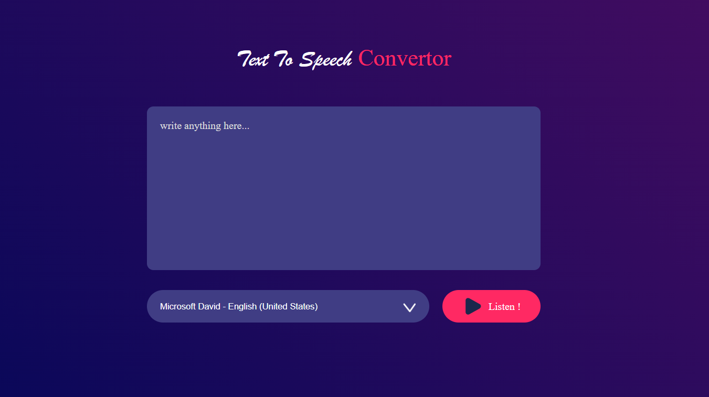

# Text 2 speech convertor
# WebSite-link
  [https://ttc-sigma.netlify.app/]

A Text-to-Speech (TTS) Converter web application is a tool for converting written text to spoken words. This technology is especially beneficial to people with visual impairments, those who prefer to listen to reading, and anyone looking to improve the accessibility and usability of textual content.

# Text-Stack Used :

HTML
CSS
JavaScript

# Some Features :

# User-Friendly Interface:

The application typically has a clean and intuitive interface that allows users to easily input or paste text for conversion.

# Text Input:

Users can input text through a text box where they can either type or paste the content they want to convert into speech.

# Language Support:

The application may support multiple languages to cater to a diverse user base.

# Voice Selection:

Users often have the option to choose from a variety of voices with different accents and tones. Some applications might even provide gender options.
 
 # Output Images :

